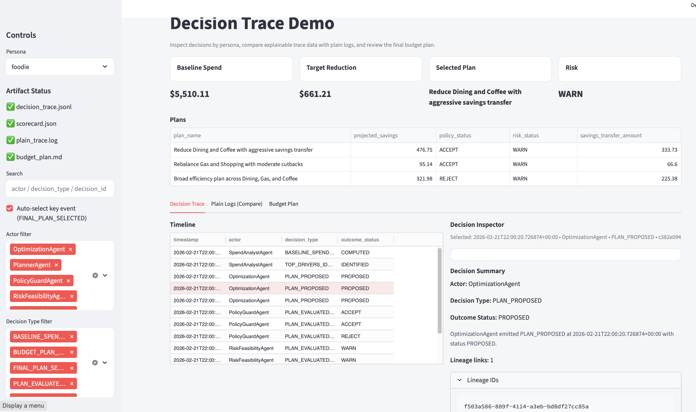

# CrewAI Decision Trace (v1)

A deterministic Decision Trace integration layer for CrewAI.

This repository provides:

-   A one-line `@trace_decision` decorator for CrewAI task functions
-   An optional `DecisionLoggingTool` for agent-facing reasoning logs
-   A reference 5-agent workflow demonstrating structured decision
    telemetry
-   Offline HTML and Streamlit viewers
-   A verification loop to ensure semantic correctness

---

## Quickstart

```bash
git clone https://github.com/logicoflife/crewai-decision-trace.git
cd crewai-decision-trace

python3 -m venv .venv
source .venv/bin/activate
python -m pip install -U pip
python -m pip install -e .

PYTHONPATH=src python -m dt_crewai_demo.cli demo_all
```

### Outputs

```
out/runs/<persona>/decision_trace.jsonl
out/runs/<persona>/.sdk_decision_trace.jsonl
out/decision_trace_view.html
```

If prompted to view execution traces, select `N`.

---


# Why This Exists

Most agentic systems emit logs.

This integration emits **decisions**.

Decision Trace is a universal semantic structure that captures:

-   Context
-   Actor
-   Logic
-   Outcome
-   Lineage

This eliminates the "black box" problem in agent workflows.

------------------------------------------------------------------------

# Quick Example

``` python
from crewai_decision_trace import trace_decision, set_default_emitter

set_default_emitter(emitter)

@trace_decision("PLAN_EVALUATED_POLICY")
def evaluate_plan(task):
    return {
        "decision_id": "...",
        "decision_type": "PLAN_EVALUATED_POLICY",
        "timestamp": "...",
        "context": {...},
        "actor": {...},
        "logic": {...},
        "outcome": {...},
        "lineage": [...]
    }
```

No manual emit calls. No viewer changes. No schema changes.

------------------------------------------------------------------------

# Integration Surfaces

## Decorator-Based (Recommended)

Instrument CrewAI task functions with `@trace_decision`.

Best for:

-   Clean adoption
-   Deterministic behavior
-   Minimal friction
-   Production workflows

------------------------------------------------------------------------

## Agent Tool (Optional Advanced Pattern)

Expose structured decision logging as a CrewAI Tool:

``` python
from crewai_decision_trace.tools import DecisionLoggingTool
```

This allows agents to log mid-process rationale during reasoning.

------------------------------------------------------------------------

# Reference Demo Included

This repository contains a deterministic 5-agent CrewAI workflow:

1.  SpendAnalystAgent\
2.  OptimizationAgent\
3.  PolicyGuardAgent\
4.  RiskFeasibilityAgent\
5.  PlannerAgent

Each agent emits structured Decision Trace events.

Outputs include:

-   `.sdk_decision_trace.jsonl`
-   structured decision log
-   plain log comparison
-   verification report
-   HTML viewer
-   Streamlit viewer

------------------------------------------------------------------------
## Interactive Decision Trace Viewer

Below is the Streamlit-based decision trace viewer generated after running the demo.

It provides:

- Structured decision telemetry (Context, Actor, Logic, Outcome, Lineage)
- Plan comparison with policy and risk validation
- Agent-level timeline view
- Raw semantic decision inspection
- Cross-filtering by actor and decision type


------------------------------------------------------------------------

# Philosophy

Decision Trace is not logging.

It is a semantic decision layer.

CrewAI provides orchestration. Decision Trace provides meaning.

Together, they make agent systems auditable.

------------------------------------------------------------------------

# Version

Public Release: **v1**
